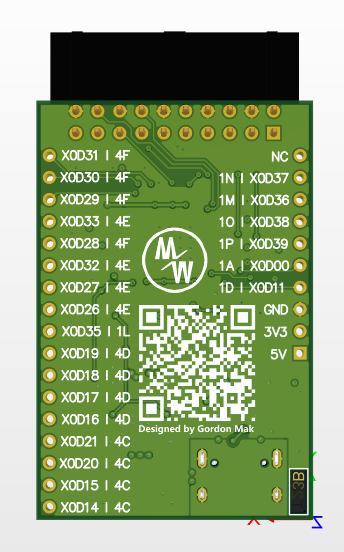

# XMOS XU(F)208 Breakout Board <!-- omit in toc -->

XMOS XU208/XUF208 series minimal system board with USB Type-C port, full XSYS debug port, all pin already breakout to edge of the board.

#### Table of Contents <!-- omit in toc -->

- [1. Image](#1-image)
- [2. Altium Libraries](#2-altium-libraries)
- [3. Shield](#3-shield)
- [4. About fabrication files](#4-about-fabrication-files)
  - [4.1. Gerber files](#41-gerber-files)
  - [4.2. NC drill files](#42-nc-drill-files)
- [5. Last](#5-last)

## 1. Image

## 2. Altium Libraries

All using components from [Altium-Components-Libraries](https://github.com/mywinchester/Altium-Components-Libraries), this is an open source project focus on refined component management. Classified components with 3D model, easy to use schematic with different package, and also using official recommended layout.

## 3. Shield

Now we have two shield for this breakout board:

- [XUF208-Clock-Board](https://github.com/mywinchester/XUF208-Clock-Board) : Clock generated board with CDCE913 PLL, with I2C interface. Clock output from Y1 pin.

- [XUF208-IO-Board](https://github.com/mywinchester/XUF208-IO-Board) : Four LEDs and four buttons board.

And there have a table for complete plan:

| XUF208-Breakout-Board | XUF208-Clock-Board | XUF208-DAC-Board | XUF208-ADC-Board | XUF208-SPDIF-Board | XUF208-IO-Board |
| :-------------------- | :----------------- | :--------------- | :--------------- | :----------------- | :-------------- |
| X0D31(4F)             |                    |                  |                  |                    |                 |
| X0D30(4F)             |                    |                  |                  |                    |                 |
| X0D29(4F)             |                    |                  |                  |                    |                 |
| X0D33(4E)             |                    |                  |                  |                    |                 |
| X0D28(4F)             | -> I2C_SCL         | -> I2C_SCL       | -> I2C_SCL       |                    |                 |
| X0D32(4E)             |                    |                  |                  |                    |                 |
| X0D27(4E)             |                    |                  |                  |                    |                 |
| X0D26(4E)             | <-> I2C_SDA        | <-> I2C_SDA      |                  |                    |                 |
| X0D35(1L)             | <- MCLK            | -> MCLK          | -> MCLK          | -> MCLK            |                 |
| X0D19(4D)             |                    |                  |                  |                    | <- BUTTON_1     |
| X0D18(4D)             |                    |                  |                  |                    | <- BUTTON_2     |
| X0D17(4D)             |                    |                  |                  |                    | <- BUTTON_3     |
| X0D16(4D)             |                    |                  |                  |                    | <- BUTTON_4     |
| X0D21(4C)             |                    |                  |                  |                    | -> LED_1        |
| X0D20(4C)             |                    |                  |                  |                    | -> LED_2        |
| X0D15(4C)             |                    |                  |                  |                    | -> LED_3        |
| X0D14(4C)             |                    |                  |                  |                    | -> LED_4        |
| -                     | -                  | -                | -                | -                  | -               |
| X0D37(1N)             | -> LRCLK           | -> LRCLK         | -> LRCLK         |                    |                 |
| X0D36(1M)             | -> BCLK            | -> BCLK          | -> BCLK          |                    |                 |
| X0D38(1O)             | -> DIN             | -> DIN           |                  |                    |                 |
| X0D39(1P)             |                    |                  | <-DOUT           |                    |                 |
| X0D00(1A)             |                    |                  |                  | <- S/PDIF_RX       |                 |
| X0D11(1D)             |                    |                  |                  | -> S/PDIF_TX       |                 |

## 4. About fabrication files

Folder Gerber include **gerber files** and **NC drill files**. If your manufacturer using other format or setting for fabrication files, you should not be use those files.

### 4.1. Gerber files

Exported with following settings:

- Unit: Inches
- Format: 2:5
- Output Layout: Plot all layers, except:
  - Mechanical 13
  - Mechanical 15
  - Mechanical 16
  - Top Pad Master
  - Buttom Pad Master
- Plot all used drill pairs
- Use software arcs
- other setting use default

Note:
> `Mechanical 1`(Gerber/XUF208_Breakout.GM1) for board shape.
>
> `Mechanical 17`(Gerber/XUF208_Breakout.GM17) for describe impedance detail.

### 4.2. NC drill files

Exported with following settings:

- default

## 5. Last

Have fun with it :)
